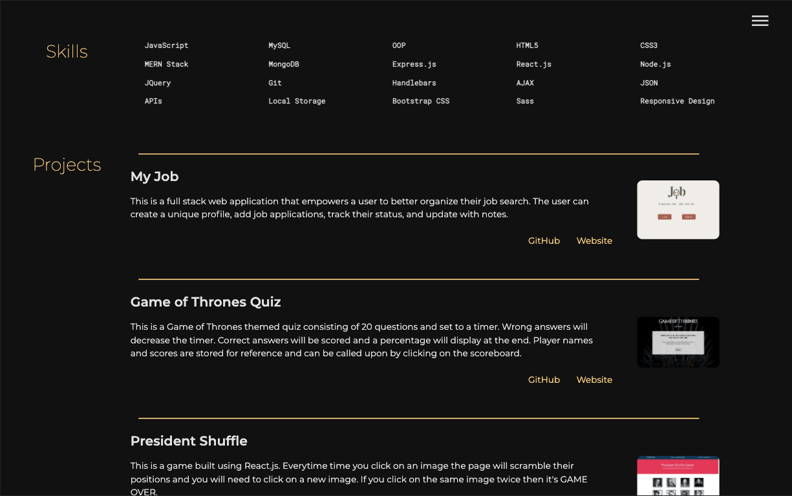

# My Website

## Table of Contents
* [Project Summary](#project-summary)
* [How to Access](#how-to-access)
* [Technologies Used](#technologies-used)
* [About Me](#about-me)
* [Screenshots](#screenshots)
* [Code Snippets](#code-snippets)

## Project Summary
My website features some information about myself and my web development projects. It demonstrates my knowledge of using vanilla JavaScript, HTML, and CSS to build a website.

## How to Access
* [https://jk-webdev-website.web.app/](https://jk-webdev-website.web.app/)

## Technologies Used
* [JavaScript](https://developer.mozilla.org/en-US/docs/Web/JavaScript)
* [HTML5](https://developer.mozilla.org/en-US/docs/Web/Guide/HTML/HTML5)
* [CSS3](https://developer.mozilla.org/en-US/docs/Web/CSS)
* [Sass](https://sass-lang.com/)

## About Me
* [LinkedIn](https://www.linkedin.com/in/the-real-jordan-kelly/)
* [GitHub](https://github.com/profjjk)

## Screenshots




## Code Snippets
Dynamic navigation menu.
```javascript
// DOM Selectors.
const menu = document.querySelector('.menu');
const menuBtn = document.querySelector('.menu-btn');
const menuNav = document.querySelector('.menu-nav');
const navItems = document.querySelectorAll('.nav-item');
// Show/Hide Nav-Menu Toggle.
let showMenu = false;
const toggleMenu = () => {
  if (!showMenu) {
    menuBtn.classList.add('close');
    menuNav.classList.add('show');
    menu.classList.add('show');
    navItems.forEach(item => item.classList.add('show'));
    showMenu = true;
  } else {
    menuBtn.classList.remove('close');
    menuNav.classList.remove('show');
    menu.classList.remove('show');
    navItems.forEach(item => item.classList.remove('show'));
    showMenu = false;
  }
}
// Event Listener.
menuBtn.addEventListener('click', toggleMenu)

```
DOM manipulation with raw JavaScript.
```javascript
const projectSection = document.getElementById('projects');

for (let i = 0; i < projects.length; i++) {
  // Create elements.
  const row = document.createElement('div');
  const mainDiv = document.createElement('div');
  const linkDiv = document.createElement('div');
  const image = document.createElement('img');
  const websiteLink = document.createElement('a');
  const githubLink = document.createElement('a');
  const title = document.createElement('h2');
  const desc = document.createElement('p');
  const hr = document.createElement('hr');
  // Add attributes.
  row.classList.add('row');
  image.setAttribute('src', `${projects[i].image}`);
  image.setAttribute('alt', `${projects[i].title}`);
  websiteLink.setAttribute('href', `${projects[i].website}`);
  websiteLink.setAttribute('target', '_blank');
  githubLink.setAttribute('href', `${projects[i].github}`);
  githubLink.setAttribute('target', '_blank');
  // Create text nodes.
  let titleText = document.createTextNode(`${projects[i].title}`);
  let descText = document.createTextNode(`${projects[i].description}`);
  let webText = document.createTextNode('Website');
  let githubText = document.createTextNode('GitHub');
  // Assemble and append to section.
  title.appendChild(titleText);
  desc.appendChild(descText);
  websiteLink.appendChild(webText);
  githubLink.appendChild(githubText);
  linkDiv.appendChild(websiteLink);
  linkDiv.appendChild(githubLink);
  mainDiv.appendChild(title);
  mainDiv.appendChild(desc);
  mainDiv.appendChild(linkDiv);
  row.appendChild(mainDiv);
  row.appendChild(image);
  projectSection.appendChild(hr);
  projectSection.appendChild(row);
}
```
Writing CSS with the Sass extension.
```css
main {
  &.home {
    height: 80vh;
    background: $hero-image no-repeat center;
    background-size: cover;
    padding: 0 2%;
    display: grid;
    grid-template-columns: 75% 25%;
    #headings {
      align-self: end;
    }
  }
  &.work {
    display: grid;
    grid-auto-rows: minmax(auto, auto);
    padding: 5% 1%;
    section {
      display: grid;
      grid-template-columns: 15% 85%;
      margin-bottom: 5%;
      h3 {
        font-size: 2em;
        text-align: center;
        font-weight: 100;
        color: $secondary-color;
        margin: 0;
      }
    }
  }
  &.contact {
    height: 100vh;
    padding: 0 5%;
    display: flex;
    flex-direction: column;
    justify-content: center;
  }
  &.life {
    height: 100vh;
    background: $collage-image no-repeat center;
    background-size: cover;
    padding: 3%;
    display: grid;
    grid-auto-rows: minmax(auto, auto);
    h3 {
      font-size: 2em;
      text-align: center;
      font-weight: 100;
      color: $secondary-color;
    }
  }
}
```

[](https://opensource.org/licenses/MIT)